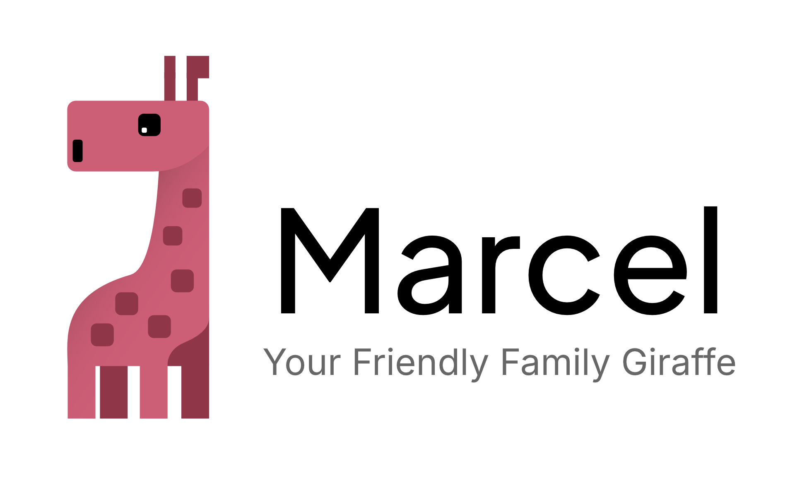

  <picture>
    <source media="(prefers-color-scheme: dark)" srcset="docs/design/logo-text-white.png" />
    <source media="(prefers-color-scheme: light)" srcset="docs/design/logo-text-black.png" />
    
  </picture>

# 🦒 Marcel

Marcel is one continuous conversation on your iPhone with an agent that lives on your home server.
You tell Marcel what you want. Marcel starts Claude Code sessions to do the work, on the server or
in the cloud, and keeps you posted. You can open any of those sessions, watch it work, steer it and
approve what it asks for. A 3D giraffe at the top of the chat shows what Marcel is doing: one glowing
spot for every task in flight.

Marcel is a **shell around Claude Code**, not a new agent. Every model token is spent by the
unmodified `claude` CLI on a Claude subscription. Marcel's own code keeps the state, moves the
messages, supervises the sessions and draws the app.

## Status

**v3 is being rebuilt from scratch.** The plan is in [`plan/`](plan/):

| Read | For |
|---|---|
| [plan/01-functional-spec.md](plan/01-functional-spec.md) | What Marcel v3 must do |
| [plan/02-architecture.md](plan/02-architecture.md) | How it is built |
| [plan/04-agent-playbook.md](plan/04-agent-playbook.md) | How the work is split across agents |

Marcel v2, the pydantic-ai family assistant on Telegram, is preserved on the
[`legacy/v2`](https://github.com/shbunder/marcel/tree/legacy/v2) branch.
