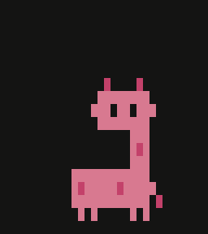
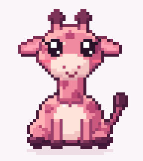
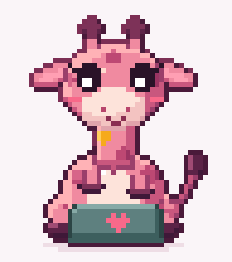

# SP5, round 5b: the professional giraffe (current proposal)

The owner liked round 5 but asked for something more business-like, keeping a little of the Dots-style cuteness.
Same character, grown up: smaller head on a longer neck, small calm eyes, no blush, Marcel's deeper rose, tidy spots,
a crisper deep-teal bow tie, calmer motion (head tilt, nod, small wave instead of hops), chat-style "..." bubbles
instead of floating code, a teal check badge for "done", and a profile-picture crop for chat and accounts.
The live preview has a switch between Professional and the friendly round-5 version.

- [vector-pro-states.png](screenshots/vector-pro-states.png): idle, thinking, working, happy.
- [vector-pro-profile-pictures.png](screenshots/vector-pro-profile-pictures.png): the profile-picture crop in all four states.
- Dropped in this pass: the "hoof to chin" thinking pose (a long arm across the body looked awkward).

---

# SP5, round 5: vector giraffe (friendly version, kept for comparison)

**Why:** the owner judged the Clawd-style giraffe "doesn't look like a giraffe at all" and asked for a critical,
creative pass: either drop the giraffe for something simple and fun, or use fluent lines as a homage to pixels.

**Result:** a flat vector giraffe with a big round head, a neck, a round body, short horn knobs, the logo's rounded
spots, little arms that act, and an optional deep-teal bow tie as its signature. Live preview (private):
https://claude.ai/artifact/C9R1wHyzqdevt8cHkjg4yu

- [vector-giraffe-states.png](screenshots/vector-giraffe-states.png): idle, thinking (hoof on cheek), working (laptop, glowing spots, code symbols), happy (hop, arms up).
- [vector-giraffe-icon-sizes.png](screenshots/vector-giraffe-icon-sizes.png): 24, 32, 48, 96 px.
- [vector-dot-matrix-rejected.png](screenshots/vector-dot-matrix-rejected.png): the same giraffe as LED dots; rejected.

## Judged against current mascots

Duolingo's Duo ([reshaping Duo](https://blog.duolingo.com/reshaping-duo/)), OpenAI's Dots and Clawd share: a silhouette
you know at icon size, 2–3 colours, a face that carries emotion, one signature detail. This design meets all four;
it reads as a pink giraffe at 24 px. It is less distinctive than Clawd; the bow tie and the logo's spots carry the identity.

## What was tried and dropped in this round

- First vector version: a bowling-pin silhouette, cow-like white muzzle, antenna horns, gradient. Fixed.
- Dot-matrix ("pixel homage"): the face falls apart at 40 × 44 dots. Pixels stay a nod only (rounded-square spots, four-point sparkles).
- Dropping the giraffe: not needed once vector gave enough room for a neck.

## How it is made

`vector/marcel.js` draws the giraffe as SVG from (state, time); `vector/review.js` renders review sheets with
`rsvg-convert`; `vector/preview.template.html` + `marcel.js` build the live preview page. Not yet in the iOS app:
it needs a SwiftUI port of the same shapes (or a Rive file) once the design is approved.

---

# SP5, round 4: Marcel in Clawd style (rejected by the owner: not a giraffe)

**Why:** the owner likes Clawd, the Claude Code mascot (simple pixel art, with typing and thinking poses) and asked
for Marcel in that style: still a rose-pink giraffe, colours aligned with Anthropic's.

**Status:** done in the simulator. The app now has a style switch (Clawd style / Detailed) and four modes.



- [marcel-clawd-all-dark.gif](screenshots/marcel-clawd-all-dark.gif), [marcel-clawd-all-ivory.gif](screenshots/marcel-clawd-all-ivory.gif): idle, thinking, working, happy (19 s).
- [marcel-clawd-keyframes.png](screenshots/marcel-clawd-keyframes.png): idle, ear flick, thinking, typing (two frames), hop.
- [app-clawd-working.png](screenshots/app-clawd-working.png): in the app.

## What Clawd is, exactly

Decoded from the Claude Code logo, which is drawn with terminal block characters (`▐▛███▜▌` / `▝▜█████▛▘` / `▘▘ ▝▝`):
every pixel is twice as tall as it is wide; one flat colour (Claude clay `#d97757`); no outline or shading;
a 12×4 body; single-pixel eye holes; 2-pixel claws on the sides; four 1-pixel legs. Community versions
([clawd-spinner](https://github.com/zhanbodev/clawd-spinner)) show the poses: side-on at a grey laptop with code
symbols floating up, thought dots, a page, a magnifying glass.

## How Marcel maps onto it

- **Body:** Clawd's wide, low block, in profile, with four 1-pixel legs and a tail.
- **Neck at the back, head on top:** the layout of Marcel's logo.
- **Head:** a small Clawd facing you: two eye holes, and Clawd's side claws become the giraffe's ears.
- **Giraffe signs:** two horn stubs with dark tips and three darker spots. Nothing else.
- **Colours:** rose `#d87990` (hue 345°, at the softness of Claude clay), spots `#c3416a`. Props use Anthropic's
  palette: cloud grey `#b0aea5` laptop and thought dots, dusty blue `#6a9bcc`, sage `#788c5d` and clay `#d97757` for
  code symbols and sparkles. Eye holes show the background, like Clawd's.
- Two earlier sketch rounds were dropped: the front-facing versions were too tall and read as a robot or totem, and the first side view was muddled.

## Loops (100 ms steps)

| Loop | Length | What happens |
|---|---|---|
| Idle | 4.8 s | head bobs down over the neck, blinks (one, then a double), each ear flicks, glances both ways |
| Thinking | 2.4 s | eyes glance up toward three grey thought dots that appear one by one |
| Working | 3.2 s | at a side-on grey laptop, front hoof taps in bursts, one code symbol at a time (`<` `>` `/` `;` `{`) floats up in blue, green or clay |
| Happy | 1.6 s | hops, ears out, coloured sparkles pop |

43 unique frames, 32 × 36 pixels each. Source: `pixel-source/clawd_style.py` (run it, copy `out/marcel-clawd-sheet.*` into `SP5Avatar/`).

## Checked (iPhone 16 Pro simulator, iOS 18.5)

- Working loop, 40 s: 60 fps average, 60 for the slowest 1%, worst frame 20 ms.
- The 19 s GIF decodes in Apple's image decoder: 192 frames.
- Not run on a real iPhone.

## Weak spots

- The thinking dots are tall pixels, so up close they look like short dashes, not round dots (true of Clawd's too).
- The typing hoof is two pixels; it reads as "reaching" more than "typing" unless you watch the taps.
- Loops repeat exactly. Several short idles picked at random would hide that.

---

# SP5, round 3: cute pink pixel-art giraffe (current, "Detailed" style in the app)

**Why:** the owner judged rounds 1 and 2 (boxes, plush, first pixel try) as not good enough, and
asked for a cute pink giraffe in pixel-art style, free to depart from the logo, built from proper source material.

**Status:** done in the simulator. **Open:** run on the iPhone, and the owner's verdict.

 

- [giraffe-idle.gif](screenshots/giraffe-idle.gif): idle loop, 6.4 s.
- [giraffe-working.gif](screenshots/giraffe-working.gif): working loop, 3.2 s.
- [pixel-giraffe-keyframes.png](screenshots/pixel-giraffe-keyframes.png): neutral, blink, ear flick, glance, two working frames.
- [app-idle.png](screenshots/app-idle.png), [app-working.png](screenshots/app-working.png): in the app.

## What the research said, and what was applied

| Source said | Applied |
|---|---|
| Claude's pixel art fails when it never looks at its own output ([Trochim](https://piotrtrochim.substack.com/p/teaching-claude-to-create-pixel-art)); good results came from references and checking ([The A.I. Beat](https://www.the-ai-beat.com/blog/2026-09-27-coding-claude-opus-5-5-is-making-pixel-art-animations-now)) | Every version rendered to a picture and reviewed before the next change (seven review passes) |
| Chibi: 2–3 heads tall, big eyes, tiny nose and mouth ([Clip Studio chibi guides](https://tips.clip-studio.com/en-us/articles/4897)) | Front-facing, sitting, head about 40% of the height, 5×6 eyes with two shines and lashes, blush, small smile |
| Colour ramps that shift hue: shadows towards purple, highlights towards peach; few colours ([SLYNYRD](https://www.slynyrd.com/blog/2018/1/10/pixelblog-1-color-palettes), [Lospec](https://lospec.com/palette-list/tag/pink)) | Five-step ramps per material (pink, cream, spots, plum, ear, teal, glow), 34 colours in all |
| Idle: 1 px of up-and-down, 300–500 ms per step, uneven timing, secondary motion lags a frame ([sprite-ai animation principles](https://www.sprite-ai.art/guides/animation-principles)) | Body sinks 1 px for 600 ms; head follows 100 ms later, horns 100 ms after that; blinks and ear flicks at irregular times |

## How it is made

- `pixel-source/build.py` (Python, no extra packages) draws the giraffe from parts on a 48×54 grid.
  Each part is shaded as one rounded form, light from the top left. A dark line goes where a part overlaps
  another, and a plum outline goes round the outside (lighter on the lit side). Face details go on last.
- It exports a **sprite sheet** (55 frames, 5 KB) plus a timeline (`giraffe-sheet.json`), and the two GIFs.
- The app just plays the sheet at a whole-number zoom, so pixels stay sharp. The 3D code from rounds 1–2 is
  removed from the app; it is in git history (commit `a478eef`).
- To change the giraffe: edit `build.py`, run `python3 build.py anim`, copy `out/giraffe-sheet.*` into `SP5Avatar/`.

## Animation

- **Idle (6.4 s loop):** breathing with follow-through, one blink then a double blink, left ear flick, right ear flick,
  a glance to the side, tail swaying.
- **Working (3.2 s loop):** a small teal laptop with a heart on the lid. Eyes look down at the screen, hooves tap
  in bursts, and spots on the neck and shoulder glow orange one after another with a warm halo and a sparkle (the old `working(3)` idea).

## Checked (iPhone 16 Pro simulator, iOS 18.5)

- Idle and working, 40 s each: **60 fps average, 60 for the slowest 1%**, worst frame 29–33 ms.
- GIFs open in Apple's own image decoder: idle 40 frames / 6.4 s, working 31 frames / 3.2 s.
- Not run on a real iPhone. It is a 5 KB image swapped a few times a second, so I expect no trouble, but that is not measured.

## Weak spots

- Front view only. No side view, walk or turn yet; each new pose is more drawing.
- The typing hooves read as a dark line over the laptop at small sizes.
- The loops are fixed, so a watcher will notice the 6.4 s repeat. Fix: several short idle loops picked at random.
- The body pink is lighter and cuter than the brand rose (`#f08aa0`); brand rose `#cc5e76` is now the shadow tone.
- The glow halo and sparkles are 1–2 pixels; at icon size they mostly disappear.

---

# SP5, round 2: plush and pixel-art looks (superseded; code removed from the app)

**Why:** the owner wanted a redesign in the soft, fluffy style of OpenAI's "Dots", still a giraffe,
animated and alive. Round 1 (below) is a flat copy of the logo. Round 2 builds two new looks into
the same app, with a switch at the top: **Plush**, **Pixel**, and **Boxes v1** (round 1, kept for comparison).

**Still open:** frame rate and energy on the iPhone (none connected), and the owner's choice between Plush and Pixel.

## Pictures

- [compare-new-looks-idle.png](screenshots/compare-new-looks-idle.png): logo | Pixel | Plush, idle.
- [compare-new-looks-working3.png](screenshots/compare-new-looks-working3.png): the same with `working(3)`.
- [filmstrip-plush-idle.png](screenshots/filmstrip-plush-idle.png): seven frames, 1.5 s apart: head nods and turns, ears move, tail swings, one frame mid-blink.
- [filmstrip-pixel-idle.png](screenshots/filmstrip-pixel-idle.png): the same for Pixel.

## What each look does to feel alive

| | Plush (3D, RealityKit) | Pixel (SwiftUI, drawn pixel by pixel) |
|---|---|---|
| Breathing | body swells and relaxes, slow weight shift | chest rises one pixel |
| Blinking | every 3.6 s, plus a longer gap one | same |
| Head | gentle sway, nods, and every 9 s looks ahead for a moment; eyes shift with it | nod, and a glance that moves the eye a pixel |
| Ears | floppy, flick every 5 s (new: the logo has none) | flick every 5 s |
| Horns | sway a moment behind the head | trail the head by a beat |
| Tail | three segments swing one after the other (new) | swishes (new) |
| `working(3)` | head dips, eyes narrow, spots 1, 3, 5 glow orange in turn | head dips, eyes narrow, same spots glow in a chase, small sparkles |
| Fuzz | 5 thin see-through fur layers over body, neck, head, legs; felt-patch spots | not applicable; two extra shades give soft edges |
| Turn 25° | yes, real 3D | no (flat by nature) |

## How they were checked (iPhone 16 Pro simulator, iOS 18.5, on an M1 Pro Mac)

| Look and state | Average fps | Slowest 1% of frames |
|---|---|---|
| Pixel, working, 45 s | 60 | 60 |
| Plush, idle, 45 s | 59 | 60 |
| Plush, working + turned, 45 s | 59 | 60 |

- One long frame (130–400 ms) at app start-up in every run. It is the first frame, not a stutter.
- **Problem found and fixed:** the plush first showed a 1%-low of 30 fps in working mode. Cause: the
  spot glow built a new material on every frame. Now nine glow steps are made once and swapped. Idle was never affected.
- **Motion from a 14 s video of the plush:** legs unchanged in 129 of 130 sampled frames; head,
  eyes, ears, horns and tail moved in 126–130. Blinking was measured in round 1 (eye closes for about 0.14 s every 4.2 s) and uses the same idea here.
- Simulator numbers only. The iPhone is the real test, and plush is the one more likely to show a difference.

## Honest weak spots

**Plush**
- The neck looks like a balloon. A real plush giraffe has a slight taper and a mane. The head is a flattened oval.
- Colour is dustier than the brand rose (a flat-front area reads about `#c37182`, brand is `#cc5e76`) because lighting and fur layers lighten and grey it. Lighting numbers are in `PlushLook` at the top of `PlushGiraffeView.swift`.
- The fur is five see-through layers, not real hair. It looks good at this size. Close up or on a big screen the edge shows as a dotted halo.
- About 90 objects in the scene. Fine in the simulator; the phone has to confirm.

**Pixel**
- Chunkier than the logo (36 × 78 pixel grid). The ear and tail are new additions.
- Two extra shades of rose (light edge, dark edge) beyond the palette file.

## What I take from this

- **Plush** is the closer match to "fluffy Dots", and its depth and head movement make it look more alive. It costs more to draw.
- **Pixel** is cheap (steady 60 fps, tiny), and the recipe-in-code approach makes other animals easy: one new part list per animal, same painter and same animations.
- **Recommendation: Plush as the main avatar, Pixel for small sizes** (notification icons, menu bar) if the phone confirms plush runs smoothly. If the phone struggles, drop the fur layers first (set `furLayers` to 2 or 3), then fall back to Pixel.
- **Other animals** (the "animal pics" idea): both looks are driven by a list of parts, so an animal is a new list, not new code. Not built yet.
- Plush needed no custom shader (no special graphics program). Real hair-style fur or a soft glowing rim would need one, and I have not tried that.

## To check on the iPhone (add to the list in round 1)

Run the app, switch **Look** between Plush and Pixel, leave each in Idle and Working(3) for a minute, and
write down the top line. Then tell me which you want, and whether the plush stutters.

---

# SP5, round 1 — RealityKit giraffe from boxes: result

**Status: built and working in the simulator. Two things are still open and need the owner:
the frame rate on the iPhone (no phone was connected) and the "that's Marcel" verdict.**

## The question

Can a giraffe made of rounded boxes, drawn by RealityKit with the logo palette, look like
`docs/design/logo.png` and run at a steady 60 frames per second? (`plan/03-spikes.md` § SP5.)

## Answer so far

| Pass condition | Result |
|---|---|
| Looks like the logo | **Close, owner has to judge.** Same shape, colours, eye, nostril, horns and spots. The neck curve is the one visible difference (see below). |
| Idle animation (breathing + blinking) | **Works.** Measured from a video, see below. |
| `working(3)`: three spots glow | **Works.** Spots 1, 3 and 5 pulse orange about every 1.2 s. |
| Unlit vs PBR | **Both built, switchable in the app.** Unlit is the flat logo look. PBR gives soft depth, and a turned view shows real 3D. |
| Steady 60 fps on the iPhone | **NOT MEASURED. No iPhone was connected.** The app has a built-in counter, ready to run (steps below). |
| Energy use on the iPhone | **NOT MEASURED.** Same reason. |
| Simulator frame rate (not the iPhone) | 60 fps average, 60 fps for the slowest 1% of frames, in the heaviest mode (PBR + turned + glowing), 40 s run. One slow frame of 130–180 ms at app start-up. |

The simulator runs on this Mac (M1 Pro). Its 60 fps says the scene is not heavy. It does not
say what the iPhone does.

## Screenshots (iPhone 16 Pro simulator, iOS 18.5)

- [compare-logo-unlit-pbr.png](screenshots/compare-logo-unlit-pbr.png): logo | Unlit | PBR, idle.
- [compare-working3.png](screenshots/compare-working3.png): logo | Unlit | PBR, `working(3)`.
- [pbr-turned.png](screenshots/pbr-turned.png): PBR turned 25°, `working(3)`.
- [hud-pbr-working.png](screenshots/hud-pbr-working.png): the app with its controls and frame counter.
- [unlit-idle.png](screenshots/unlit-idle.png): the raw Unlit screenshot.

## Not tested

- The on-screen controls (Unlit/PBR, Idle/Working(3), Turn 25°, brightness fix, Reset) were not
  tapped. Nothing here can tap the simulator. The same states were checked through launch options,
  which use the same code, but the first tap on the phone is the real test.
- Nothing was run on a real iPhone.

## What differs from the logo

- **Neck.** The logo has one smooth sweeping curve from head to back. Boxes can only make
  steps: a rounded block at the base of the neck and a big rounded body. Recognisable, not identical.
- **Soft shading.** The logo has a faint darker gradient on the neck and back. Unlit is flat.
- **Far legs and haunch.** The dark patch at the back is a rounded box that bulges slightly.
- **Eye and nostril in PBR** look dark grey, not black, because lighting lifts them.

## What was run

- Xcode 26.6 (`DEVELOPER_DIR=/Applications/Xcode.app/Contents/Developer`; the Mac's default
  developer folder points at the command line tools, which cannot build apps).
- Project: `SP5Avatar.xcodeproj`, one iPhone app target, minimum iOS 18.0, Swift 5 mode, no packages.
- Built and run on the iPhone 16 Pro simulator, iOS 18.5.
- Build command (building the target directly; see "Plan changes" for why):
  ```
  DEVELOPER_DIR=/Applications/Xcode.app/Contents/Developer \
  xcodebuild -project SP5Avatar.xcodeproj -target SP5Avatar -sdk iphonesimulator \
    -configuration Debug ARCHS=arm64 CODE_SIGNING_ALLOWED=NO build
  ```
- What the code does:
  - `giraffe.json`: 21 boxes, measured in logo pixels, coloured by role (rose `#cc5e76`,
    maroon `#8e3447`, orange `#f6aa1c`, plus black and white for the eye).
  - `RealityView` with `.virtual` camera, narrow 22° lens from 3 m so Unlit stays close to flat.
  - `AvatarSystem`: one custom RealityKit `System` that runs every frame: breathing, blinking, glow.
  - `FPSMeter`: counts real screen frames, shows now / average / slowest-1% / worst frame.
- Launch options for repeatable screenshots: `-style pbr`, `-mode working`, `-yaw 1`, `-hud 0`, `-fix 0`.

### Animation check (from a 10 s screen recording of the simulator)

- **Breathing:** the head rises and falls 22 px (of 2622) in a smooth 4 s cycle.
- **Blinking:** the eye closes to about 20% for roughly 4 video frames (0.14 s), every 4.2 s.
- **Glow:** spot 1 swings between `#d08241` and `#f8b42b` about every 1.2 s.

## Findings that change how F13 should be built

1. **Unlit colours come out too dark in RealityKit.** On the simulator, asking for rose
   `#cc5e76` showed `#b34f65`, and the off-white background came out light grey. White showed as
   about `#d6d6d6`. This is not the camera effects (switched off, no change) and not RealityView
   specifically (the older `ARView` did the same). The app now asks for a brighter colour,
   using a measured table in `AvatarMaterials.brightnessFix`, and lands within 1–4 of 255 on the palette.
   **This was measured on the simulator only.** The on-screen switch "Flat-colour brightness fix"
   turns it off. On the phone, compare with the fix on and off. If the phone is already correct
   with it off, the table is only a simulator workaround and should not ship.
2. **iOS 18 `RealityView` has no plain background colour.** The brand "Snow" background is a
   large flat panel behind the giraffe. Fine for the avatar, but it means the avatar cannot be
   transparent over other app content without a different approach.
3. **Boxes cannot make the logo's neck curve.** If a closer match matters, F13 needs one curved
   piece (a custom mesh from a drawn outline) for the neck and shoulder, and boxes for the rest.
4. **The recipe file does not exist yet.** The plan names `shared/avatar/recipes/giraffe.json`;
   this spike ships its own copy as `SP5Avatar/giraffe.json`. Its format (pixel boxes from the
   logo, a palette-role name per box, an animation tag, a glow list) worked and can seed the shared one.
5. **`maroon` is not in `docs/design/palette.json`.** The spike uses `#8e3447` from the spec. The
   logo's own dark colour measures `#8f3649`. Add maroon to the palette file, and decide which one wins.
6. **Build tool quirk.** `xcodebuild -scheme … -destination …` often failed with "iOS 26.5 is not
   installed" even though a simulator runtime was available. Building the target directly worked
   every time. Relevant to any later automated build for the app.

## To finish on the iPhone (about 5 minutes)

1. Open `scratch/spikes/SP5-avatar/SP5Avatar.xcodeproj` in Xcode.
2. Project → target SP5Avatar → Signing: pick your team (the field is blank on purpose).
3. Plug in the iPhone, choose it as the run target, press Run. The scheme runs the Release build,
   which is what matters for speed.
4. In the app, tap Reset on the counter, leave each mode for 60 seconds, and write down the
   top line (now / avg / 1% low / worst). Do these four: Unlit idle, Unlit working(3),
   PBR idle, PBR working(3) with "Turn 25°" on.
5. For energy use: in Xcode, open the Debug navigator → Energy Impact while it runs.
6. Compare with the screenshots above and the logo. Say "that's Marcel" or say what is off.
7. Also try the "Flat-colour brightness fix" switch off and on, and tell me which looks like the logo.

Note: Pro iPhones can run screens at 120 Hz. This spike did not opt in (that needs one extra
setting), so expect it to be capped at 60. That matches the pass condition. 120 Hz is a later question.

## What the plan changes because of this

- F13 (avatar) is not blocked: the approach works. Use RealityView, boxes from a JSON recipe, one
  custom System for idle and working states.
- Add to F13: a colour check on the real phone (finding 1), and a decision on the neck curve (finding 3).
- SP5 stays **open** until the iPhone numbers and the owner's verdict are in.
